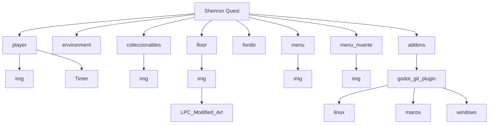

# Shenron-Quest       
### Desarrollo de un videojuego de plataformas 2D utilizando Godot Engine

---

**Autores:** Daniel Herrero Hernández, Alexis Rodríguez Ragel
**Asignatura:** Desarrollo de Videojuegos  
**Titulación:** Desarrollo de Aplicaciones Multiplataforma (DAM)  
**Motor de desarrollo:** Godot Engine  
**Lenguaje de programación:** GDScript  

---

## Introducción

El presente trabajo describe el desarrollo de **Shenron-Quest**, un videojuego de plataformas en dos dimensiones desarrollado mediante el motor **Godot Engine**. El objetivo del proyecto ha sido implementar un prototipo funcional que incorpore diferentes sistemas propios del desarrollo de videojuegos, tales como el control de personajes, animaciones, detección de colisiones, gestión de cámara, menús interactivos y sistemas de recolección de objetos.

El videojuego se inspira en la estética y narrativa del universo de *Dragon Ball*, combinando una ambientación retro basada en **pixel art** con mecánicas clásicas de videojuegos de plataformas. Este enfoque permite recrear una experiencia de juego sencilla pero funcional, siguiendo principios básicos del diseño de videojuegos.

Además de su componente técnico, el proyecto ha sido desarrollado aplicando herramientas de control de versiones como **Git**, lo cual permite gestionar el trabajo colaborativo y mantener un registro del desarrollo del proyecto.

---

## Desarrollo

### Conceptualización del videojuego

#### Idea general

**Shenron-Quest** es un videojuego de plataformas 2D en el que el jugador controla al personaje de **Goku**, quien debe explorar diferentes escenarios para recuperar las **esferas del dragón**. Durante su recorrido, el jugador deberá superar obstáculos, evitar enemigos y recoger elementos coleccionables distribuidos por el nivel.

#### Mecánicas principales

El videojuego implementa diferentes mecánicas que constituyen la base de su jugabilidad:

- Movimiento lateral del personaje.
- Sistema de salto.
- Animaciones dinámicas del personaje.
- Interacción con el entorno.
- Detección de colisiones.
- Recolección de objetos coleccionables.
- Sistema de menús y gestión del flujo del juego.

---

### Arte y recursos gráficos

#### Estilo visual

El estilo visual del videojuego se basa en **pixel art**, una técnica ampliamente utilizada en videojuegos retro y en proyectos independientes.

El uso de pixel art también genera una estética nostálgica que recuerda a los videojuegos clásicos.

#### Recursos gráficos utilizados

Los recursos gráficos utilizados en el proyecto incluyen:

- Sprites del personaje principal (Goku).
- Sprites del enemigo dinámico (Dinosaurio)
#### Ejemplo de spritesheet del personaje

El siguiente spritesheet muestra diferentes **frames de animación del personaje principal**. 
Cada frame representa una fase distinta del movimiento del personaje y permite crear animaciones fluidas dentro del motor de juego.

  

Lo mismo con el enemigo dinámico del juego.

  

---

### Programación e implementación

#### Motor de desarrollo

El videojuego ha sido desarrollado utilizando **Godot Engine**, un motor de videojuegos open source que permite crear videojuegos en dos y tres dimensiones. Godot utiliza una arquitectura basada en **nodos y escenas**, lo que facilita la organización modular de los elementos del juego (Godot Engine, 2024).

Cada escena puede contener múltiples nodos que representan diferentes componentes del juego, como personajes, cámaras o elementos del entorno.

#### Arquitectura del proyecto

El proyecto se organiza mediante una estructura de carpetas que permite separar los diferentes componentes del videojuego. Una estructura simplificada del proyecto sería la siguiente:

Esta organización permite mantener una estructura clara del proyecto y facilita el mantenimiento del código.

---

### Desarrollo del personaje

El personaje principal del videojuego se implementa mediante una escena compuesta por varios nodos. Entre los nodos más importantes se encuentran:

- **CharacterBody2D**, que gestiona la física del personaje.
- **AnimatedSprite2D**, encargado de mostrar las animaciones.
- **CollisionShape2D**, que define la forma de colisión del personaje.
- **Camera2D**, que permite que la cámara siga al jugador.

Esta estructura permite separar las diferentes responsabilidades del personaje dentro del motor de juego.

---

### Sistema de animaciones

El personaje dispone de múltiples animaciones que se activan dependiendo del estado del jugador. Entre las animaciones implementadas se encuentran:

- Idle (reposo)
- Run (correr)
- Jump (saltar)
- Attack (ataque)
- Dead (muerte)

> Attack implementada pero no funcional

El cambio entre animaciones se realiza de forma automática según el estado del personaje, lo que permite mejorar la sensación de fluidez en el movimiento.

---

### Gestión de colisiones

Las colisiones dentro del juego se gestionan mediante nodos de tipo **CollisionShape2D** y mediante los **TileMaps** del escenario. Estos elementos permiten definir qué partes del entorno son sólidas y cuáles funcionan únicamente como decoración.

---

### Diseño del nivel

El diseño del nivel se realiza utilizando **TileSets**, que permiten construir escenarios reutilizando diferentes piezas gráficas. El uso de TileSets permite combinar elementos del entorno como plataformas, obstáculos y elementos decorativos dentro de un mismo escenario.

---

### Sistema de cámara

El videojuego utiliza una **Camera2D** asociada al personaje principal. Este sistema permite que la cámara siga automáticamente al jugador durante su desplazamiento por el escenario, manteniendo siempre visible la zona relevante del juego.

---

### Sistema de coleccionables

Uno de los elementos clave del videojuego es la recolección de **esferas del dragón**, que funcionan como objetos coleccionables. Cuando el jugador entra en contacto con uno de estos objetos, se activa un evento que incrementa un contador y elimina el objeto del escenario.

Este sistema se implementa mediante señales y detección de colisiones.

---

### Sistema de menús

El videojuego incorpora diferentes interfaces de usuario que permiten gestionar el flujo del juego:

- Menú principal
- Menú de muerte o derrota
- Menú de victoria
- Interfaz de juego

Estos menús permiten reiniciar el juego, salir del mismo o volver al menú principal.

---

## Elementos destacables del desarrollo

Queremos hacer mención honorifica a diferentes partes del desarrollo del videojuego:

- Cinemáticas
- Contador de vidas
- Temporizador
- Sistema de ataque ( implementado pero no funcional)
- Script global
- Sistema de grupos

## Conclusión

El desarrollo de **Shenron-Quest** ha permitido aplicar conocimientos fundamentales del desarrollo de videojuegos utilizando el motor Godot.

Además, el proyecto ha permitido experimentar con herramientas de control de versiones y metodologías de trabajo colaborativo, aspectos fundamentales en el desarrollo de software. Con varios problemas y desgracias.

"# Dragon-Ball-La-caza-de-las-esferas" 
